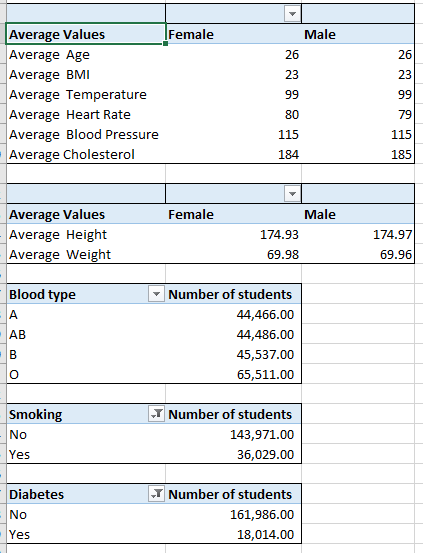
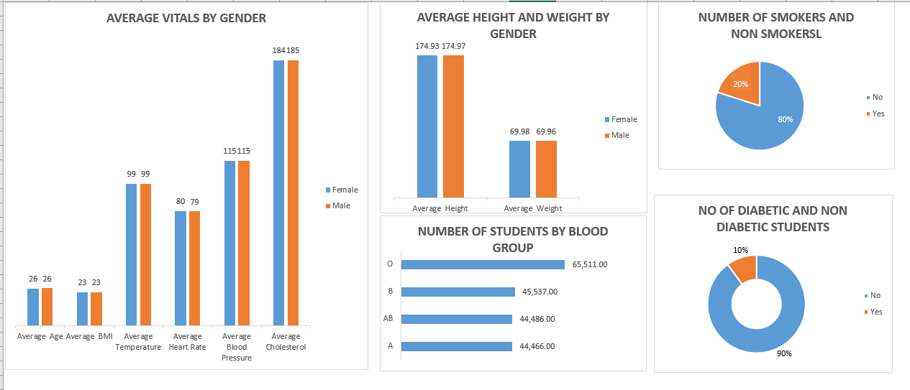

# The application of Pivot-Table-and-Data-Visualization to describe the Sample data of medical students in X University

A pivot table is a powerful data analysis tool in Excel that allows users to summarize, analyze, and manipulate large datasets quickly and easily. 
It enables users to create a dynamic, interactive summary report from a source data table, providing a consolidated view of the data.

Data visualization is the graphical representation of data to present complex information in a clear and visually appealing manner. 
It is an essential part of data analysis and communication, as it allows users to understand patterns, trends, and insights quickly.

# Task 1
Using the Medical Students Data, create Pivot Tables displaying the following:
Average values for the following for Male and Females (Age, BMI, Temperature, Heart Rate, Blood Pressure, and Cholesterol)
Average Height and Weight for both Genders (in 2 decimal places)
Number of students across the different Blood Groups
Number of Students who smoke and those who don’t
Number of Students who have diabetes and those who don’t

The goal is to Analyse the vitals for medical students as it relates to their gender as male and female. It is also required that i determine the number of students across the different blood groups, the number of Students that smokes and those that don't. Finally, the number of Students that have diabetes and those that Don't have Diabetes.

The First step is to clean the data. This involves detecting and correcting corrupt or inaccurate records from a data set. It's referd to a process of identifying incomplete, incorrect, inaccurate or irrelevant parts of the data,and then replacing, modifying of dirty data.

This is followed by the creation of Pivot Table on a seperate work sheet, by clicking on Pivot table on the Tables Tab and selecting the required options on the ddialog box. 

The next step is to create the visuals. This is achieved by clicking on analyse under Pivot table tools and selecting the accurate chart for the analysis.

The Average Vitals by Gender, shows that theres no significant different in the Male Vitals as compared to the females'. However, there's a slight difference in Average herat rate and Aerage Cholesterol by just one unit.

From the column chart labelled Average height and weight,there's no significant difference in the average height and weight for the female students compared to the male students. This is probably because they are in the same age group,as can be seen from the Average vitals by gender chart.

The number of students by blood type chart has shown that the school in question has the highest number of students with blood type O. students with Blood type A and AB are the leaset in number with Type AB having 20 students more than type A. The most important reason for keeping this data is in case of an emergency where a blood transfusion is required.

The Pie chart shows that the number of students that don't smoke is very significantly higher than the number of students that smokes. 20% of the medical students are smokers while 80% are non smokers.

10% of the students are diabetic while 90% are non diabetic as shown in the doughnut chart. 

